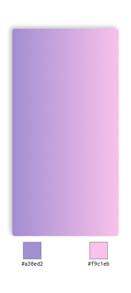
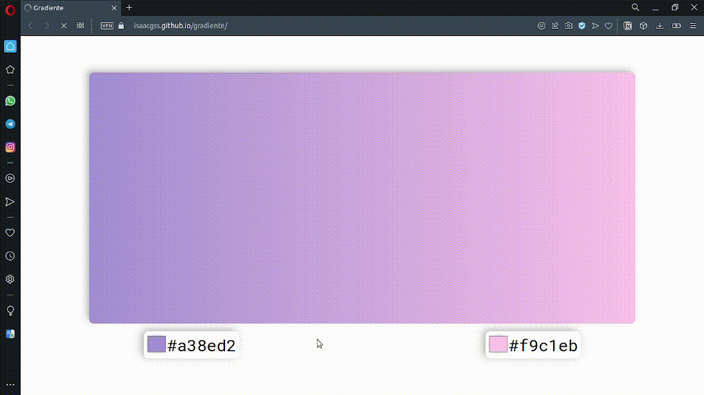

# 🦄 gradiente
<q>Ferramenta para ter um preview 👀 de gradientes que deseja implementar em seus projetos.</q> 
## 📜 Status
> Status: demo

## 👨‍💻 Technology
> 
> 
> 

## 💻 Funcionalidades

> * 2 input <code>type="color"</code> 🌈;
> * Um preview 👀 das cores celecionadas em gradiente ;
> * Ao celecionar as cores, em tempo real⌚ nós é retornado a gradinete da combinação;
> * Responsividade 📱;

## 👀 Preview
 
> 
> 
> 
> ### Gif
> 
